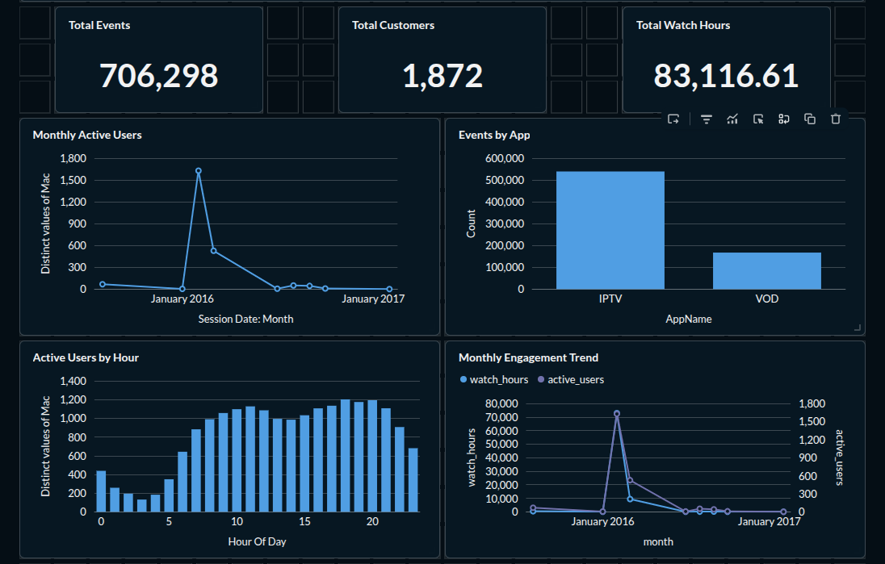

# FPT Play STB Log — Analytics Pipeline

> Analyze churned subscriber behavior from log files using PySpark, PostgreSQL, Airflow, and Metabase.

---

## Project Summary

Built an end-to-end data engineering pipeline to process **~1M raw log events** from **1,693 churned FPT Play subscribers** (2015–2017), uncovering behavioral patterns that explain customer churn.

**Key findings:**
- Finding 01 — Crashed Sessions
STARTCHANNEL appearing as a last action looked unremarkable. ~24% of churners left after the app failed them, not because they chose to leave.

- Finding 02 — VOD Playback Failure
85% of sessions ended at 0–25% completion. PlayingFromSearch — where users actively sought specific content — had nearly identical completion rate to PlayingFromHome (3.3% vs 3.9%). The problem happens in the first 2 minutes of playback, regardless of how the user arrived.

- Finding 03 — February Anomaly
A spike to 1,272 active users in February 2016, followed by near-zero activity by March -> Users consuming remaining content before cancelling.

---

## Architecture

```
data/raw/logt*.txt
  Python-dict-string format
        |
        v
spark_jobs/ingest.py          
        |
        v
spark_jobs/transform.py       
        |
        v
data/processed/
  fact_sessions.parquet        
  user_profiles.parquet       
        |
        v
spark_jobs/load.py            
        |
        v
PostgreSQL                    
        |
        v
Metabase Dashboard            
        |
        v
Airflow DAG                  
```

---

## Tech Stack

| Layer          | Tool                        |
|----------------|-----------------------------|
| Processing     | PySpark 3.5                 |
| Storage        | PostgreSQL 15               |
| Serialization  | Apache Parquet              |
| Orchestration  | Apache Airflow 2.8          |
| Visualization  | Metabase                    |
| Package mgmt   | uv                          |
| Containers     | Docker Compose              |

---

## Project Structure

```
streaming-log-pipeline/
|-- pipeline.py                  
|-- pyproject.toml              
|-- docker-compose.yml           
|-- .env.example
|
|-- spark_jobs/
|   |-- ingest.py                
|   |-- transform.py             
|   |-- load.py                  
|
|-- dags/
|   `-- fptplay_pipeline_dag.py  
|
|-- sql/
|   |-- init.sql                 
|   |-- schema.sql               
|   `-- analytics.sql            
|
|
`-- data/
    |-- raw/                     
    `-- processed/               
```

---

## Airflow DAG

```
check_files -> ingest -> transform -> load -> quality_check
```

| Task           | Description                                          |
|----------------|------------------------------------------------------|
| check_files    | ShortCircuit — skip pipeline if no new files         |
| ingest         | PySpark parse dict-string logs -> Parquet            |
| transform      | Feature engineering, churn labels, Window functions  |
| load           | Parquet -> PostgreSQL via SQLAlchemy                 |
| quality_check  | Validate row counts, null rates, date range          |

Schedule: daily at 2:00 AM. Trigger manually via Airflow

---

## Dashboard (Metabase)

Connect to `localhost:5432`, database `log_pipeline`.

| Chart                              | Insight                                        |
|------------------------------------|------------------------------------------------|
| Monthly Active Users               | Spike Jan 2016 then rapid drop-off             |
| Events by App                      | IPTV 76% vs VOD 24%                            |
| VOD Completion Rate                | 68% abandon in first 25% of content            |
| Active Hours                       | Peak 10:00-22:00                               |
| Last Action Before Churn           | 806 users last action was START/STOPCHANNEL    |
| Watch Time vs Completion Buckets   | 0-25% group watches avg 2.2 min vs 52.7 min    |

---

## Analytics SQL

```sql
-- VOD completion rate distribution
SELECT
    CASE
        WHEN completion_rate < 0.25 THEN '0-25% (dropped early)'
        WHEN completion_rate < 0.50 THEN '25-50%'
        WHEN completion_rate < 0.75 THEN '50-75%'
        ELSE '75-100% (completed)'
    END AS bucket,
    COUNT(*) AS sessions
FROM fact_sessions
WHERE "AppName" = 'VOD'
GROUP BY 1
ORDER BY 1;

-- Last action before churn per user
SELECT last_event, COUNT(*) AS users
FROM (
    SELECT DISTINCT ON ("Mac") "Mac", "Event" AS last_event
    FROM fact_sessions
    ORDER BY "Mac", session_timestamp DESC
) t
GROUP BY last_event
ORDER BY users DESC;
```

## Dashboard Preview



## Dashboard Preview

(docs/dashboard1.png)

## Dashboard Preview

(docs/dashboard1.png)
